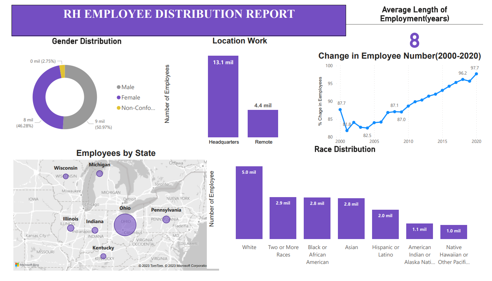

# HR-REPORT-MySQL-PowerBi

### DATA USED

**Data** - HR Data with over 22000 rows from the year 2000-2020  
**Data Visualization** - Power Bi

### QUESTIONS 

1. What is the gender breakdown of employees in the company?

2. What is the race/ethnicity breakdown of employees in the company?
  
3. What is the age distribution of employees in the company?

4. How many employees work at headquarters versus remote locations?       
	
5. What is the average length of employment for employees who have been terminated?
    
6. How does the gender distribution vary across departments and job titles?

7. What is the distribution of job titles across the company?	
	
8. Which department has the highest turnover rate?
    
9. What is the distribution of employees across locations by state?
    
10. How has the company's employee count changed over time based on hire and term dates?

11. What is the tenure distribution for each department?

### Summary of Findings

	- The number of terminate and hired are increment every year

### Limitations

    - Some records are negative ages and these are excluded during queriying(967 records)
    - Some termdates were far into the future and were not incluying in the analysis (1599 records)    
